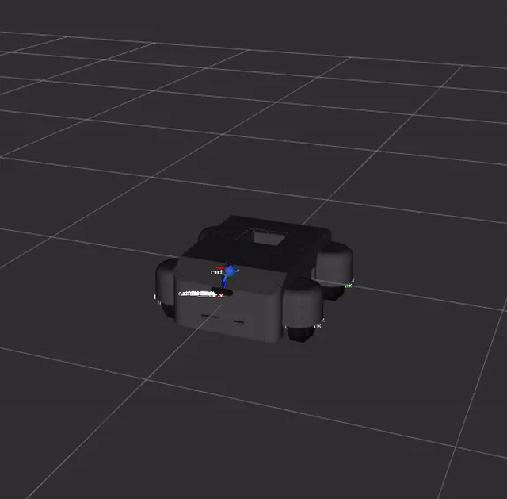

# 基础模型与接口层

[English](./README.md) | 中文

---

本层放置底盘工程中最基础、最少依赖、被其它层共同引用的包。它定义机器人几何模型、坐标系、ros2_control 硬件资源描述，以及建图/定位流程需要的自定义服务接口。

## 包清单

- `swerve_description`: 四转四驱舵轮底盘 URDF/Xacro、RViz 配置、传感器安装位和 ros2_control 硬件接口描述。
- `interface`: 建图、重定位、地图保存、地图优化等流程使用的 ROS 2 service 定义。

## 职责边界

本层只描述“机器人是什么”和“跨包接口是什么”。它不直接实现电机驱动、控制器、SLAM、导航或仿真逻辑。其它层应通过包名依赖 `swerve_description` 和 `interface`，不要复制 URDF、坐标系或 service 定义。

## 关键约定

- 机器人主体坐标系为 `base_link`，平面投影为 `base_footprint`。
- 轮组顺序统一为 `fl`, `fr`, `bl`, `br`。
- 转向关节为 `<prefix>_steering_joint`，驱动轮关节为 `<prefix>_wheel_joint`。
- MID-360 安装坐标系为 `mid360_link` 和 `livox_frame`。
- D435 相关坐标系同时暴露 `d435_*` 与 `camera_*` 兼容命名。
- 轴距 0.42 m、轮距 0.52 m、轮半径 0.075 m 是当前控制与 URDF 的共同几何基准。

## 使用方式

通常不单独启动本层。启动实车底盘时由 `system_bringup_layer/swerve_bringup` 解析 Xacro 并加载 `robot_state_publisher`、`controller_manager` 和控制器配置。

## 许可证

本包通过 知识共享 署名-非商业性使用-相同方式共享 4.0 国际许可协议 (CC BY-NC-SA 4.0) 进行许可。

版权所有 (c) 2026 成都长数机器人有限公司 (Chengdu Changshu Robot Co., Ltd.)

详情请参阅 [LICENSE](LICENSE) 文件或访问：http://creativecommons.org/licenses/by-nc-sa/4.0/

## 致谢

本包是 OpenFlex 全身人形机器人平台生态系统的一部分，专为人形机器人领域的研究和工业应用而开发。

---

## 📞 联系我们

### 成都长数机器人有限公司
**Chengdu Changshu Robotics Co., Ltd.**

| 联系方式 | 信息 |
|---------|------|
| 📧 邮箱 | openarmrobot@gmail.com |
| 📱 电话/微信 | +86-17746530375 |
| 🌐 官网 | https://openarmx.com/ |
| 🌐 文档 | http://docs.openarmx.com/ |
| 📍 地址 | 天津市西青区・稻潮机器人体验基地（明日之城）・天津市人形机器人中心 |
| 👤 联系人 | 王先生 |
